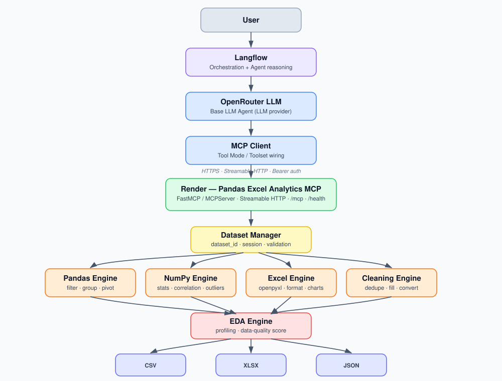

# Pandas Excel Analytics MCP

A deterministic **Model Context Protocol (MCP)** server exposing Pandas,
NumPy, Excel/openpyxl, and automated EDA operations over uploaded tabular
datasets — built to be driven by an LLM agent (e.g. Langflow + OpenRouter)
through the MCP tool-calling protocol.

This server contains **no LLM, no embeddings, no RAG, and no
Langflow/OpenRouter credentials**. It is purely the deterministic
data-execution layer: 27 tools across dataset management, Pandas, NumPy,
Excel automation, EDA, and export.

Built on the current stable MCP Python SDK (`mcp` v2.x), where the server
class is `mcp.server.mcpserver.MCPServer` — the successor to the pre-2.0
`mcp.server.fastmcp.FastMCP` name used in older tutorials. The public API
(`.tool()`, `.streamable_http_app()`) is unchanged, just the import path.

---

## Architecture



```
User
  |
Langflow (orchestration + agent reasoning)
  |
OpenRouter LLM (base LLM agent)
  |
MCP Client (Tool Mode / Toolset)
  |  HTTPS · Streamable HTTP · Bearer auth
  v
Render — Pandas Excel Analytics MCP  (/mcp, /health)
  |
Dataset Manager (dataset_id, session, validation)
  |
  +---------------+---------------+---------------+
  |               |               |               |
Pandas Engine  NumPy Engine   Excel Engine   Cleaning Engine
  |               |               |               |
  +---------------+---------------+---------------+
                  |
              EDA Engine (profiling, data-quality score)
                  |
        +---------+---------+
        |         |         |
       CSV      XLSX      JSON
```

The MCP server never calls an LLM, never holds `OPENROUTER_API_KEY`, and
never executes arbitrary code — it only receives validated tool calls and
runs deterministic Pandas/NumPy/openpyxl operations.

---

## The 27 tools

| Category | Tools |
|---|---|
| **Dataset** (6) | `upload_dataset`, `list_datasets`, `dataset_info`, `preview_data`, `column_profile`, `list_sheets` |
| **Pandas** (8) | `filter_rows`, `sort_data`, `group_by`, `aggregate`, `merge_datasets`, `pivot_table`, `clean_dataset`, `value_counts` |
| **NumPy** (3) | `numpy_statistics`, `correlation_analysis`, `outlier_analysis` |
| **EDA** (2) | `eda_report`, `data_quality_report` |
| **Excel** (5) | `excel_read_range`, `excel_write_range`, `excel_format`, `excel_chart`, `excel_list_sheets` |
| **Export** (3) | `export_excel`, `export_csv`, `export_json` |

---

## Local setup

```bash
git clone https://github.com/varunmulay-droid/Pandas-excel-numpy-EDA-MCP.git
cd Pandas-excel-numpy-EDA-MCP
python3 -m venv .venv && source .venv/bin/activate
pip install -r requirements.txt
```

Run the server:

```bash
uvicorn server:app --reload --host 127.0.0.1 --port 8000
```

- MCP endpoint: `http://127.0.0.1:8000/mcp`
- Health check: `http://127.0.0.1:8000/health` → `{"status":"ok"}`

Inspect and call tools manually:

```bash
npx @modelcontextprotocol/inspector
```
Connect using transport **"Streamable HTTP"** to `http://127.0.0.1:8000/mcp`.

Run the test suite (43 tests):

```bash
pytest tests/ -v
```

---

## Deploying to Render — step by step

### 1. Push your code to GitHub
Already done if you're reading this from the repo. Otherwise:
```bash
git add -A && git commit -m "deploy" && git push
```

### 2. Create the service on Render
1. Go to [render.com](https://render.com) → **New +** → **Blueprint**.
2. Connect the `Pandas-excel-numpy-EDA-MCP` GitHub repo.
3. Render detects `render.yaml` in the repo root and pre-fills:
   - **Build command:** `pip install -r requirements.txt`
   - **Start command:** `uvicorn server:app --host 0.0.0.0 --port $PORT`
   - **Health check path:** `/health`
4. Click **Apply** to create the service.

### 3. Set environment variables
Render auto-generates `MCP_API_TOKEN` (via `generateValue: true` in
`render.yaml`). After the first deploy:

1. Open the service → **Environment** tab.
2. Copy the generated `MCP_API_TOKEN` value — you'll need it for your MCP
   client's `Authorization: Bearer <token>` header.
3. Update `MCP_ALLOWED_HOSTS` to match the exact hostname Render assigned
   to your service, e.g. `pandas-excel-numpy-eda-mcp.onrender.com`
   (Render shows this at the top of the service dashboard once created).
   **This step is required** — the MCP SDK rejects any request whose Host
   header isn't in this allowlist, by design.

### 4. Deploy
Render builds and deploys automatically on every push to `main`. Watch the
**Logs** tab for:
```
INFO:     Uvicorn running on http://0.0.0.0:10000
```

### 5. Verify the deployment
```bash
curl https://YOUR-SERVICE.onrender.com/health
# {"status":"ok"}
```

Then verify the MCP endpoint itself with MCP Inspector, pointing at:
```
https://YOUR-SERVICE.onrender.com/mcp
```
and adding header `Authorization: Bearer <MCP_API_TOKEN>` if auth is enabled.

**Production MCP URL format:**
```
https://YOUR-SERVICE.onrender.com/mcp
```

---

## Environment variables

| Variable | Purpose | Required |
|---|---|---|
| `PORT` | Port to bind (Render sets this automatically) | No |
| `MCP_API_TOKEN` | Bearer token for authenticated requests | Recommended in prod |
| `MCP_REQUIRE_AUTH` | Force auth even if you manage the token differently | No |
| `MCP_ALLOWED_HOSTS` | Comma-separated hostnames this server is reachable at | **Yes, in prod** |
| `MCP_MAX_FILE_SIZE_MB` | Upload size limit (default 50) | No |
| `MCP_MAX_ROWS` / `MCP_MAX_COLUMNS` | Dataset shape limits | No |
| `MCP_MAX_EXCEL_SHEETS` | Excel workbook sheet limit | No |
| `MCP_MAX_OUTPUT_ROWS` | Max rows returned per tool call | No |

`OPENROUTER_API_KEY` and any LLM credentials are intentionally **not**
consumed by this server — keep those in Langflow, not here.

---

## How to connect it further

### Connect to Langflow (next step)
1. In Langflow, add an **MCP Tools** (MCP Client) component.
2. Set the server URL to `https://YOUR-SERVICE.onrender.com/mcp`, transport
   **Streamable HTTP**, and header `Authorization: Bearer <MCP_API_TOKEN>`.
3. Set the component to **Tool Mode** — all 27 tools populate as a Toolset.
4. Wire that Toolset into your **Base LLM Agent** node (OpenRouter).
5. Test with a prompt like:
   *"Upload sales.csv and tell me which region has the highest profit."*

### Connect an OpenRouter-backed agent
Keep `OPENROUTER_API_KEY` in Langflow's LLM node, not in this server — the
MCP server should stay a pure tool provider so it can be reused by any
agent framework (Langflow, LangChain, Claude, custom MCP clients) without
carrying LLM-specific config.

### Future: embeddings / RAG (V3+)
Not needed for direct data operations ("group sales by region"). Consider
adding a vector store only when you need semantic search over dataset
*metadata* — e.g. "what does this column mean?" — layered in front of this
MCP server, not inside it.

### Future: persistence (V2+)
Datasets currently live in server memory and are lost on restart/redeploy.
For persistent, multi-instance deployments, swap `DatasetManager`'s
in-memory dict for object storage (S3-compatible) + a metadata database,
without changing any tool signatures.

---

## Security notes

- No `eval`/`exec`/shell execution/arbitrary imports anywhere in the codebase.
- Every dataset is addressed by an opaque `dataset_id` — callers never
  supply filesystem paths.
- Filenames are sanitised and path-joined under a fixed storage root
  (`utils/security.py::safe_join`) — path traversal is structurally
  impossible.
- `TransportSecuritySettings` host allowlist is always configured; the
  SDK's default localhost-only protection is never disabled.
- Bearer-token auth is opt-in via `MCP_API_TOKEN`; when unset the server
  runs unauthenticated (fine for local dev, **not** for a public Render URL).

---

## Project layout

```
pandas-excel-analytics-mcp/
├── server.py                  # MCP app entrypoint (Streamable HTTP, /mcp, /health)
├── requirements.txt
├── pyproject.toml
├── render.yaml                 # Render Blueprint
├── architecture.svg
├── src/pandas_excel_mcp/
│   ├── config/settings.py      # env-driven limits & config
│   ├── core/                   # dataset/session/file managers, validators
│   ├── engines/                # actual Pandas/NumPy/Excel/EDA logic
│   ├── tools/                  # thin MCP tool wrappers (27 tools)
│   ├── schemas/                # exceptions + response envelopes
│   └── utils/                  # serialization, security, logging
└── tests/                      # 43 pytest tests
```
